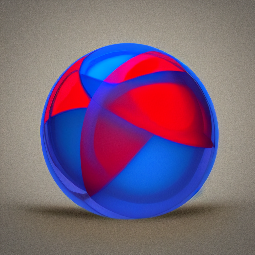
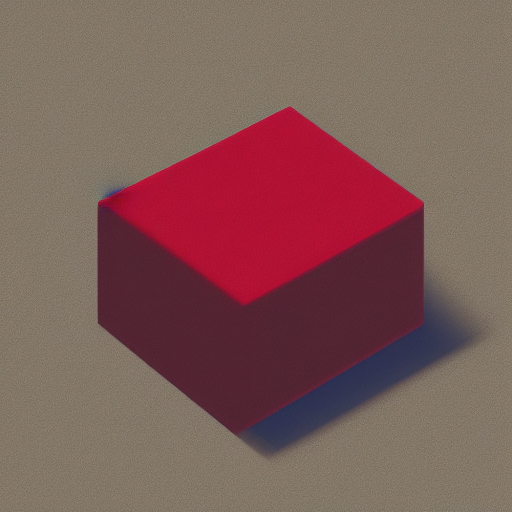
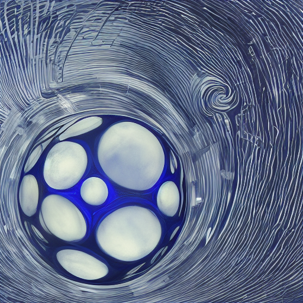
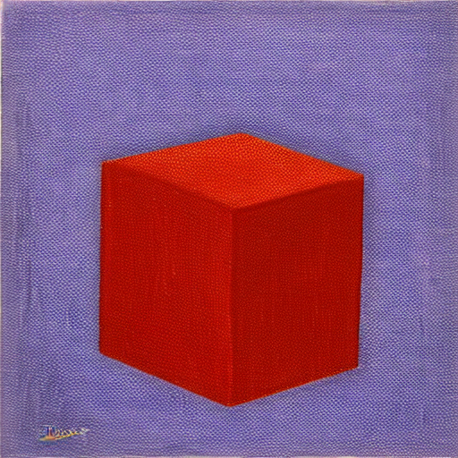

# :octicons-command-palette-24: Prompting-Features

## **Reading Prompts from a File**

You can automate `invoke.py` by providing a text file with the prompts you want
to run, one line per prompt. The text file must be composed with a text editor
(e.g. Notepad) and not a word processor. Each line should look like what you
would type at the invoke> prompt:

```bash
"a beautiful sunny day in the park, children playing" -n4 -C10
"stormy weather on a mountain top, goats grazing" -s100
"innovative packaging for a squid's dinner" -S137038382
```

Then pass this file's name to `invoke.py` when you invoke it:

```bash
python scripts/invoke.py --from_file "/path/to/prompts.txt"
```

You may also read a series of prompts from standard input by providing
a filename of `-`. For example, here is a python script that creates a
matrix of prompts, each one varying slightly:

```bash
#!/usr/bin/env python

adjectives = ['sunny','rainy','overcast']
samplers = ['k_lms','k_euler_a','k_heun']
cfg = [7.5, 9, 11]

for adj in adjectives:
    for samp in samplers:
        for cg in cfg:
            print(f'a {adj} day -A{samp} -C{cg}')
```

It's output looks like this (abbreviated):

```bash
a sunny day -Aklms -C7.5
a sunny day -Aklms -C9
a sunny day -Aklms -C11
a sunny day -Ak_euler_a -C7.5
a sunny day -Ak_euler_a -C9
...
a overcast day -Ak_heun -C9
a overcast day -Ak_heun -C11
```

To feed it to invoke.py, pass the filename of "-"

```bash
python matrix.py | python scripts/invoke.py --from_file -
```

When the script is finished, each of the 27 combinations
of adjective, sampler and CFG will be executed.

The command-line interface provides `!fetch` and `!replay` commands
which allow you to read the prompts from a single previously-generated
image or a whole directory of them, write the prompts to a file, and
then replay them. Or you can create your own file of prompts and feed
them to the command-line client from within an interactive session.
See [Command-Line Interface](CLI.md) for details.

---

## **Negative and Unconditioned Prompts**

Any words between a pair of square brackets will instruct Stable Diffusion to
attempt to ban the concept from the generated image.

```text
this is a test prompt [not really] to make you understand [cool] how this works.
```

In the above statement, the words 'not really cool` will be ignored by Stable
Diffusion.

Here's a prompt that depicts what it does.

original prompt:

`#!bash "A fantastical translucent pony made of water and foam, ethereal, radiant, hyperalism, scottish folklore, digital painting, artstation, concept art, smooth, 8 k frostbite 3 engine, ultra detailed, art by artgerm and greg rutkowski and magali villeneuve" -s 20 -W 512 -H 768 -C 7.5 -A k_euler_a -S 1654590180`

<figure markdown>

</figure>

That image has a woman, so if we want the horse without a rider, we can
influence the image not to have a woman by putting [woman] in the prompt, like
this:

`#!bash "A fantastical translucent poney made of water and foam, ethereal, radiant, hyperalism, scottish folklore, digital painting, artstation, concept art, smooth, 8 k frostbite 3 engine, ultra detailed, art by artgerm and greg rutkowski and magali villeneuve [woman]" -s 20 -W 512 -H 768 -C 7.5 -A k_euler_a -S 1654590180`

<figure markdown>

</figure>

That's nice - but say we also don't want the image to be quite so blue. We can
add "blue" to the list of negative prompts, so it's now [woman blue]:

`#!bash "A fantastical translucent poney made of water and foam, ethereal, radiant, hyperalism, scottish folklore, digital painting, artstation, concept art, smooth, 8 k frostbite 3 engine, ultra detailed, art by artgerm and greg rutkowski and magali villeneuve [woman blue]" -s 20 -W 512 -H 768 -C 7.5 -A k_euler_a -S 1654590180`

<figure markdown>

</figure>

Getting close - but there's no sense in having a saddle when our horse doesn't
have a rider, so we'll add one more negative prompt: [woman blue saddle].

`#!bash "A fantastical translucent poney made of water and foam, ethereal, radiant, hyperalism, scottish folklore, digital painting, artstation, concept art, smooth, 8 k frostbite 3 engine, ultra detailed, art by artgerm and greg rutkowski and magali villeneuve [woman blue saddle]" -s 20 -W 512 -H 768 -C 7.5 -A k_euler_a -S 1654590180`

<figure markdown>

</figure>

!!! notes "Notes about this feature:"

    * The only requirement for words to be ignored is that they are in between a pair of square brackets.
    * You can provide multiple words within the same bracket.
    * You can provide multiple brackets with multiple words in different places of your prompt. That works just fine.
    * To improve typical anatomy problems, you can add negative prompts like `[bad anatomy, extra legs, extra arms, extra fingers, poorly drawn hands, poorly drawn feet, disfigured, out of frame, tiling, bad art, deformed, mutated]`.

---

## **Prompt Syntax Features**

The InvokeAI prompting language has the following features:

### Attention weighting

Append a word or phrase with `-` or `+`, or a weight between `0` and `2`
(`1`=default), to decrease or increase "attention" (= a mix of per-token CFG
weighting multiplier and, for `-`, a weighted blend with the prompt without the
term).

The following syntax is recognised:

- single words without parentheses: `a tall thin man picking apricots+`
- single or multiple words with parentheses:
  `a tall thin man picking (apricots)+` `a tall thin man picking (apricots)-`
  `a tall thin man (picking apricots)+` `a tall thin man (picking apricots)-`
- more effect with more symbols `a tall thin man (picking apricots)++`
- nesting `a tall thin man (picking apricots+)++` (`apricots` effectively gets
  `+++`)
- all of the above with explicit numbers `a tall thin man picking (apricots)1.1`
  `a tall thin man (picking (apricots)1.3)1.1`. (`+` is equivalent to 1.1, `++`
  is pow(1.1,2), `+++` is pow(1.1,3), etc; `-` means 0.9, `--` means pow(0.9,2),
  etc.)
- attention also applies to `[unconditioning]` so
  `a tall thin man picking apricots [(ladder)0.01]` will _very gently_ nudge SD
  away from trying to draw the man on a ladder

You can use this to increase or decrease the amount of something. Starting from
this prompt of `a man picking apricots from a tree`, let's see what happens if
we increase and decrease how much attention we want Stable Diffusion to pay to
the word `apricots`:


Using `-` to reduce apricot-ness:

| `a man picking apricots- from a tree`                                                                                          | `a man picking apricots-- from a tree`                                                                                                        | `a man picking apricots--- from a tree`                                                                                                    |
| ------------------------------------------------------------------------------------------------------------------------------ | --------------------------------------------------------------------------------------------------------------------------------------------- | ------------------------------------------------------------------------------------------------------------------------------------------ |
|  |  |  |

Using `+` to increase apricot-ness:

| `a man picking apricots+ from a tree`                                                                                                      | `a man picking apricots++ from a tree`                                                                                                              | `a man picking apricots+++ from a tree`                                                                                                                     | `a man picking apricots++++ from a tree`                                                                                                                                           | `a man picking apricots+++++ from a tree`                                                                                                                                                                           |
| ------------------------------------------------------------------------------------------------------------------------------------------ | --------------------------------------------------------------------------------------------------------------------------------------------------- | ----------------------------------------------------------------------------------------------------------------------------------------------------------- | ---------------------------------------------------------------------------------------------------------------------------------------------------------------------------------- | ------------------------------------------------------------------------------------------------------------------------------------------------------------------------------------------------------------------- |
|  |  |  |  |  |

You can also change the balance between different parts of a prompt. For
example, below is a `mountain man`:


And here he is with more mountain:

| `mountain+ man`                                | `mountain++ man`                               | `mountain+++ man`                              |
| ---------------------------------------------- | ---------------------------------------------- | ---------------------------------------------- |
|  |  |  |

Or, alternatively, with more man:

| `mountain man+`                                | `mountain man++`                               | `mountain man+++`                              | `mountain man++++`                             |
| ---------------------------------------------- | ---------------------------------------------- | ---------------------------------------------- | ---------------------------------------------- |
|  |  |  |  |

### Blending between prompts

- `("a tall thin man picking apricots", "a tall thin man picking pears").blend(1,1)`
- The existing prompt blending using `:<weight>` will continue to be supported -
  `("a tall thin man picking apricots", "a tall thin man picking pears").blend(1,1)`
  is equivalent to
  `a tall thin man picking apricots:1 a tall thin man picking pears:1` in the
  old syntax.
- Attention weights can be nested inside blends.
- Non-normalized blends are supported by passing `no_normalize` as an additional
  argument to the blend weights, eg
  `("a tall thin man picking apricots", "a tall thin man picking pears").blend(1,-1,no_normalize)`.
  very fun to explore local maxima in the feature space, but also easy to
  produce garbage output.

See the section below on "Prompt Blending" for more information about how this
works.

### Cross-Attention Control ('prompt2prompt')

Sometimes an image you generate is almost right, and you just want to change one
detail without affecting the rest. You could use a photo editor and inpainting
to overpaint the area, but that's a pain. Here's where `prompt2prompt` comes in
handy.

Generate an image with a given prompt, record the seed of the image, and then
use the `prompt2prompt` syntax to substitute words in the original prompt for
words in a new prompt. This works for `img2img` as well.

- `a ("fluffy cat").swap("smiling dog") eating a hotdog`.
  - quotes optional: `a (fluffy cat).swap(smiling dog) eating a hotdog`.
  - for single word substitutions parentheses are also optional:
    `a cat.swap(dog) eating a hotdog`.
- Supports options `s_start`, `s_end`, `t_start`, `t_end` (each 0-1) loosely
  corresponding to bloc97's `prompt_edit_spatial_start/_end` and
  `prompt_edit_tokens_start/_end` but with the math swapped to make it easier to
  intuitively understand.
  - Example usage:`a (cat).swap(dog, s_end=0.3) eating a hotdog` - the `s_end`
    argument means that the "spatial" (self-attention) edit will stop having any
    effect after 30% (=0.3) of the steps have been done, leaving Stable
    Diffusion with 70% of the steps where it is free to decide for itself how to
    reshape the cat-form into a dog form.
  - The numbers represent a percentage through the step sequence where the edits
    should happen. 0 means the start (noisy starting image), 1 is the end (final
    image).
    - For img2img, the step sequence does not start at 0 but instead at
      (1-strength) - so if strength is 0.7, s_start and s_end must both be
      greater than 0.3 (1-0.7) to have any effect.
- Convenience option `shape_freedom` (0-1) to specify how much "freedom" Stable
  Diffusion should have to change the shape of the subject being swapped.
  - `a (cat).swap(dog, shape_freedom=0.5) eating a hotdog`.

The `prompt2prompt` code is based off
[bloc97's colab](https://github.com/bloc97/CrossAttentionControl).

Note that `prompt2prompt` is not currently working with the runwayML inpainting
model, and may never work due to the way this model is set up. If you attempt to
use `prompt2prompt` you will get the original image back. However, since this
model is so good at inpainting, a good substitute is to use the `clipseg` text
masking option:

```bash
invoke> a fluffy cat eating a hotdot
Outputs:
[1010] outputs/000025.2182095108.png: a fluffy cat eating a hotdog
invoke> a smiling dog eating a hotdog -I 000025.2182095108.png -tm cat
```

### Escaping parantheses () and speech marks ""

If the model you are using has parentheses () or speech marks "" as part of its
syntax, you will need to "escape" these using a backslash, so that`(my_keyword)`
becomes `\(my_keyword\)`. Otherwise, the prompt parser will attempt to interpret
the parentheses as part of the prompt syntax and it will get confused.

---

## **Prompt Blending**

You may blend together different sections of the prompt to explore the AI's
latent semantic space and generate interesting (and often surprising!)
variations. The syntax is:

```bash
blue sphere:0.25 red cube:0.75 hybrid
```

This will tell the sampler to blend 25% of the concept of a blue sphere with 75%
of the concept of a red cube. The blend weights can use any combination of
integers and floating point numbers, and they do not need to add up to 1.
Everything to the left of the `:XX` up to the previous `:XX` is used for
merging, so the overall effect is:

```bash
0.25 * "blue sphere" + 0.75 * "white duck" + hybrid
```

Because you are exploring the "mind" of the AI, the AI's way of mixing two
concepts may not match yours, leading to surprising effects. To illustrate, here
are three images generated using various combinations of blend weights. As
usual, unless you fix the seed, the prompts will give you different results each
time you run them.

<figure markdown>
### "blue sphere, red cube, hybrid"
</figure>

This example doesn't use melding at all and represents the default way of mixing
concepts.

<figure markdown>

</figure>

It's interesting to see how the AI expressed the concept of "cube" as the four
quadrants of the enclosing frame. If you look closely, there is depth there, so
the enclosing frame is actually a cube.

<figure markdown>
### "blue sphere:0.25 red cube:0.75 hybrid"



</figure>

Now that's interesting. We get neither a blue sphere nor a red cube, but a red
sphere embedded in a brick wall, which represents a melding of concepts within
the AI's "latent space" of semantic representations. Where is Ludwig
Wittgenstein when you need him?

<figure markdown>
### "blue sphere:0.75 red cube:0.25 hybrid"



</figure>

Definitely more blue-spherey. The cube is gone entirely, but it's really cool
abstract art.

<figure markdown>
### "blue sphere:0.5 red cube:0.5 hybrid"


</figure>

Whoa...! I see blue and red, but no spheres or cubes. Is the word "hybrid"
summoning up the concept of some sort of scifi creature? Let's find out.

<figure markdown>
### "blue sphere:0.5 red cube:0.5"



</figure>

Indeed, removing the word "hybrid" produces an image that is more like what we'd
expect.

In conclusion, prompt blending is great for exploring creative space, but can be
difficult to direct. A forthcoming release of InvokeAI will feature more
deterministic prompt weighting.
