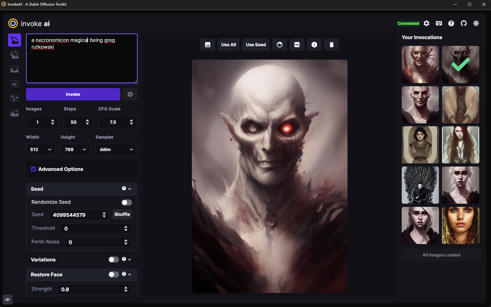
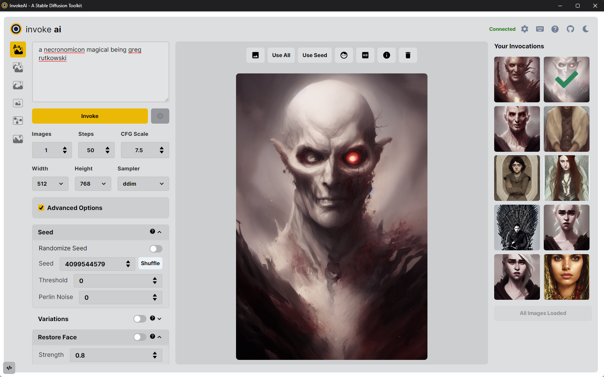

# :material-web: InvokeAI Web Server

As of version 2.0, this distribution's web server has been updated to include 
an all-new UI, with optimizations to improve common workflows for image generation.

## Getting Started & Initialization Commands

To start the web server, run the `dream.py` script by adding the `--web` parameter.

```bash
(ldm) ~/stable-diffusion$ python3 scripts/dream.py --web
```

You can then connect to the server by pointing your web browser at
http://localhost:9090, or to the network name or IP address of the server.

### Additional Options
  `--web_develop`    -   Starts the web server in development mode.
  
  `--web_verbose`    -   Enables verbose logging
  
  `--cors [CORS ...]`    -   Additional allowed origins, comma-separated
  
  `--host HOST`    -   Web server: Host or IP to listen on. Set to 0.0.0.0 to
  accept traffic from other devices on your network.
                        
  `--port PORT`    -   Web server: Port to listen on
  
  `--gui`    -   Start InvokeAI GUI - This is the "desktop mode" version of the web app. It uses Flask 
  to create a desktop app experience of the webserver.


## Web Specific Features

The web experience offers an incredibly easy-to-use experience for interacting with the InvokeAI toolkit. 
For detailed guidance on individual features, see the Feature-specific help documents available in this directory.
Note that the latest functionality available in the CLI may not always be available in the Web interface.

### Dark Mode & Light Mode 
The InvokeAI interface is available in a nano-carbon black & purple Dark Mode, and a "burn your eyes out Nosferatu" Light Mode. These can be toggled by clicking the Sun/Moon icons at the top right of the interface. 





### Invocation Toolbar
The left side of the InvokeAI interface is available for customizing the prompt and the settings used for invoking your new image. Typing your prompt into the open text field and clicking the Invoke button will produce the image based on the settings configured in the toolbar. 

See below for additional documentation related to each feature:
- [Core Prompt Settings](./CLI.md)
- [Variations](./VARIATIONS.md)
- [Upscaling](./UPSCALE.md)
- [Image to Image](./IMG2IMG.md)
- [Inpainting](./INPAINTING.md)
- [Other](./OTHER.md)

### Invocation Gallery
The currently selected --outdir (or the default outputs folder) will display all previously generated files on load. As new invocations are generated, these will be dynamically added to the gallery, and can be previewed by selecting them. Each image also has a simple set of actions (e.g., Delete, Use Seed, Use All Parameters, etc.) that can be accessed by hovering over the image.

### Image Workspace
When an image from the Invocation Gallery is selected, or is generated, the image will be displayed within the center of the interface. A quickbar of common image interactions are displayed along the top of the image, including:
- Use image in the `Image to Image` workflow
- Initialize Face Restoration on the selected file
- Initialize Upscaling on the selected file
- View File metadata and details
- Delete the file

## Acknowledgements

A huge shout-out to the core team working to make this vision a reality, including [psychedelicious](https://github.com/psychedelicious), [Kyle0654](https://github.com/Kyle0654) and [blessedcoolant](https://github.com/blessedcoolant). [hipsterusername](https://github.com/hipsterusername) was the team's unofficial cheerleader and added tooltips/docs.

